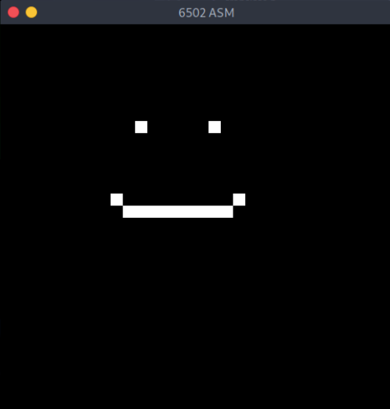

# 6502 Assembler
Unfinished custom 6502 assembly simulator/emulator written in C. The `6502_Improved/` directory contains the more refined and better functioning version of the emulator. It's using the SDL library for the Graphical output. All the instructions are not implemented yet

Just learning through the process of simulation and emulation and 6502 assembly. The current state of the emulator is unfinished.


Also have plans to port this as a C++ and Rust library (`6502asm_rs`) for people who don't like C
## How to use
To use the emulator:  

`./6502asm --build <6502asm-file>`

For graphics output

`./6502asm --build <6502asm-file> [--visual | -v]`

For the time being it will print some debugging information. Such as the data memory, the assembly (ROM) and disassembly and register values. 

## Understanding the 6502 assembly language and CPU
The 6502 CPU assembly takes use of six different registers, three of which are used for storage. These registers include:
  - Accumulator
  - X
  - Y
  - Program Counter (16 bit)
  - Stack Pointer
  - Status

The three main registers that will be commonly used are the ones used for storage, which is the Accumulator, X and Y registers. What makes the accumulator register different from X and Y is that it is able to do arithmetic and logical operations. These are useful for storing within memory via the registers. Values between these registers can also be transferred to each other.

The Program Counter register is used to read each instruction from the assembly hexdump. Each instruction is read as an opcode, a value in hex for the computer, or the assembler, to interpret. The program counter is incremented each time until end of program. This register is 16 bit so it can store the addresses up to 0xffff.

The Stack Pointer is used for storing the address within the stack, hence the name stack pointer. Most usually within the 6502 processor, the stack addresses occupy addresses from 0x0100 to 0x01ff, or within the Zero page of memory.

The Status register holds certain flags after certain operations. These flags are stored as singular bits and are interpreted by the CPU and are helpful when dealing with branching operations. Because this is an 8 bit register it stores 7 different flags (one unused). These flags consist of:
  - Carry (0)
  - Zero (1)
  - Disable Interrupts (2)
  - Decimal mode (3)
  - Break (4)
  - Unused (5)
  - Overflow (6)
  - Negative (7)

Example of using the 6502 Assembly language
The following loads within the Accumulator register and stores the value within memory
```assembly
LDA #$03
STA $0002
```
Output of visual representation of the storage memory:

`0000: 00 00 03 00 00 00 00 00 00 00 00 00 00 00 00 00`

Loading with a register is typically used with `LD`. There is `LDA`, `LDX` and `LDY`. So within the code above, we loaded the value '0x03' within the 'A' (accumulator) register. It will store this value until the register value is changed. The prefix used within this instruction `#$` is used to define that we are using a literal value, a constant value or a value not loaded from memory. The second instruction, `ST` (which include `STA`, `STX` and `STY`) is used to store within the memory at a specified address from the value of a register. In this case we're using `$0002` to represent the address. Then from the output we can see that the value from our Accumulator register is loaded within the memory address of 0x0002.

## Some things to note
1. For graphics output, within this simulator, you would need to use memory addresses within `$0200` and `$05ff`. The 6502 only provides 16 different colors represented by the lower nibble from each byte.

2. When using the `JMP` instruction in Indirect addressing mode, if the first vector is a pointer to the last byte in a page the next byte is then the first byte within that page. An example
```assembly
LDA #$40
STA $3000
LDA #$80
STA $30FF
LDA #$50
STA $3100
JMP ($30FF) ; Program Counter will equal to '$4080' rather than '$5080' than intended. So it wrapped around the page ($xx00 - $xxff)
```

3. The 6502 has some undocumented opcodes such as 'SAX' which is used to store values within both A and X register and many others (More on 'illegal' opcodes https://www.masswerk.at/nowgobang/2021/6502-illegal-opcodes)

4. The random number generator is located at memory address `$fe`
## 


## Good sources
For more sources here are:
  - http://www.6502.org/tutorials/6502opcodes.html
  - https://skilldrick.github.io/easy6502/
